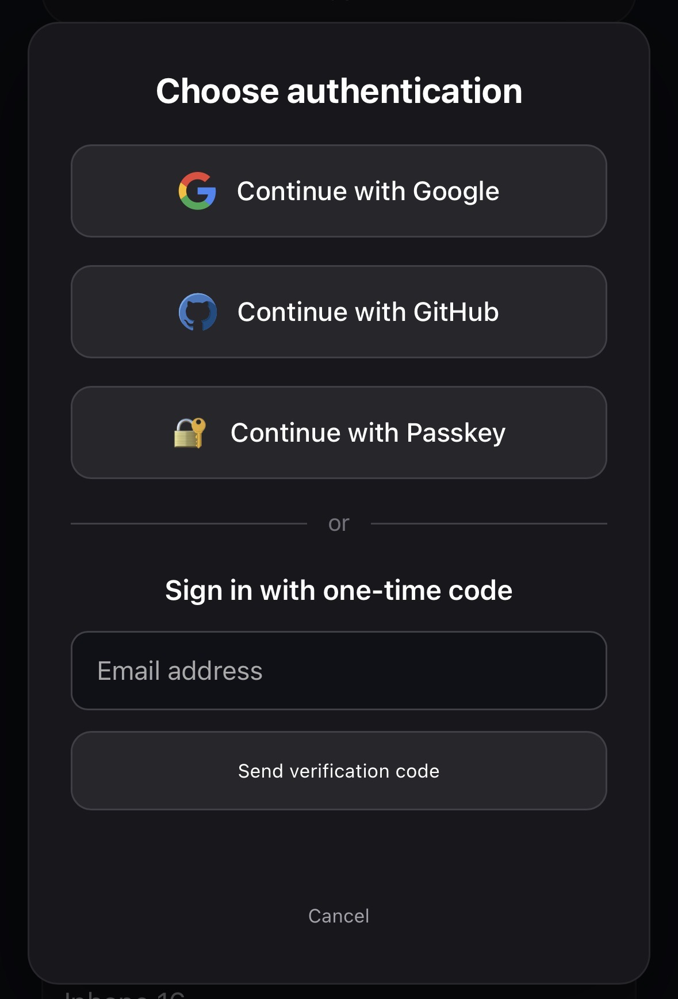
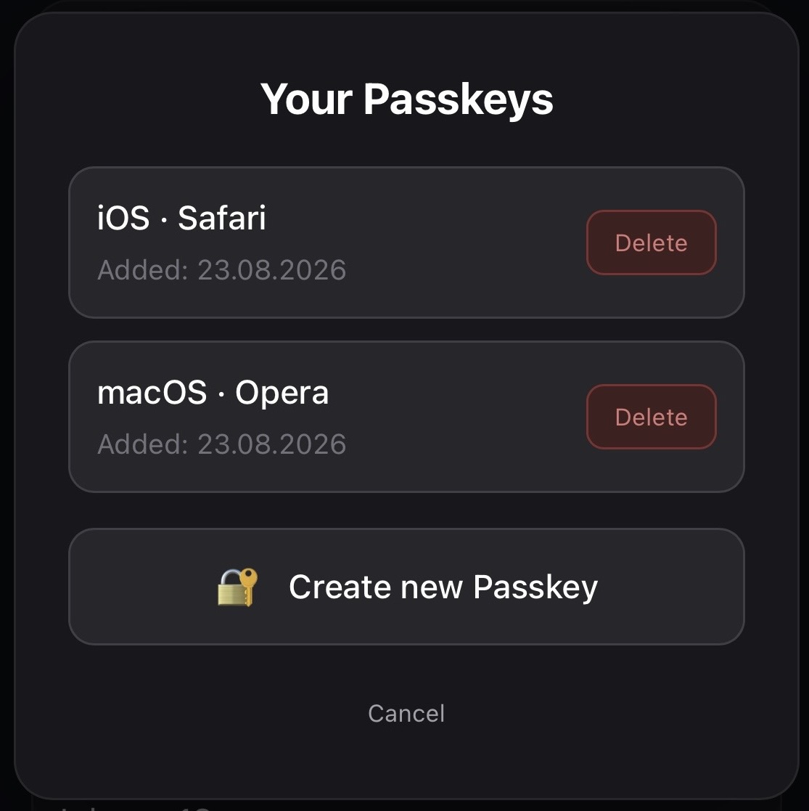
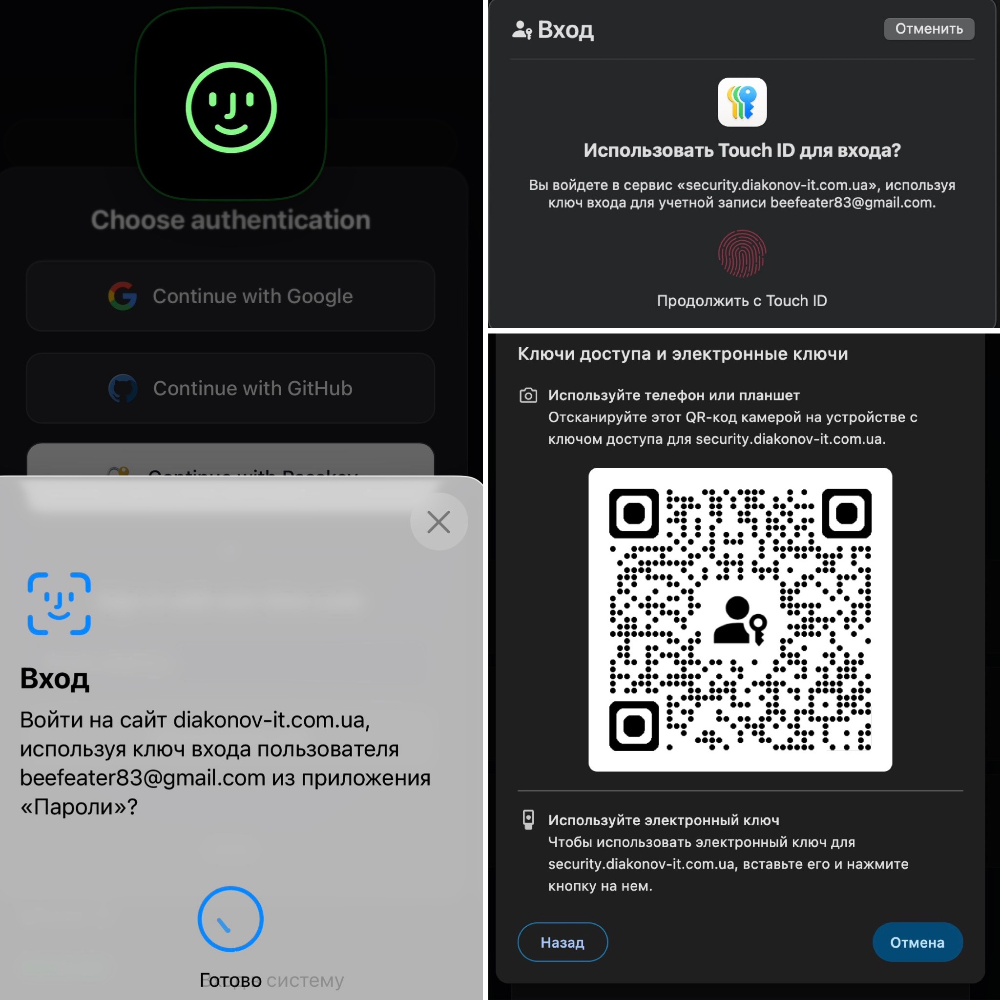

## Overview
### Production-style Symfony application.
Backend is built on top of my custom CRUD Event Bundle.

The frontend is completely separated from the backend. A lightweight frontend is included to demonstrate the REST API functionality.

## Authorization

- Login is available only for users that already exist in the database and have assigned roles.
- Login is supported via:
  - **`Google OAuth`**
  - **`GitHub OAuth`**
  - **`One-Time Password (OTP) delivered via email`**
  - **`Passkey (WebAuthn)`**
- GitHub authentication resolves the user's **`primary verified email`**, allowing users with private email visibility to authenticate successfully.
- OTP authentication is available only for registered users. A **6-digit verification code** is sent to the user's email, is valid for **5 minutes**, and can be used only once.
- Passkey authentication uses the **WebAuthn standard** and supports passwordless authentication using a device, platform authenticator, security key, or another supported passkey provider.
- Passkey authentication also supports **cross-device authentication**, allowing users to authenticate on a device without a registered Passkey by using a Passkey from another device.
- Authenticated users can register multiple Passkeys for their account and manage them by deleting their own registered Passkeys from the frontend.
- Passkey credentials are stored in the database, while the private key remains on the user's device or Passkey provider.
- After successful authentication, a custom domain event is dispatched, triggering a login notification email to the user.
- After successful login, a JWT token is issued and stored in `HttpOnly cookies` (access + refresh flow).
- Access token lifetime: **5 minutes**
- Refresh token lifetime: **1 hour**
- Refresh tokens are **rotated on each successful refresh request**.
- Access token is automatically refreshed via `/api/refresh` when expired.
- If refresh token is expired or missing, the user must log in again.

### Authentication methods

### Passkey management

### Passkey authentication (Fingerprint, Face ID & Cross-device)

## Roles and permissions
- `ROLE_ADMIN` or `ROLE_TRUSTED_USER` can perform admin actions (`POST`, `PATCH`, `DELETE`).
- ROLE_TRUSTED_USER: can perform admin actions only in the `notebook` category. Attempts on other categories return **403**
- ROLE_TRUSTED_USER can **PATCH / DELETE only their own products**. Attempts to modify products owned by other users return **403**
- If you’re logged in but don’t have the proper role, the API returns **403**.
- If you are not authenticated, the API returns **401**
- Export products to XLSX (public access)

## OAuth providers
- Google OAuth
- GitHub OAuth (supports accounts with private email visibility by resolving the primary verified email through the GitHub API)
- One-Time Password (OTP) via email
- Passkey (WebAuthn)

